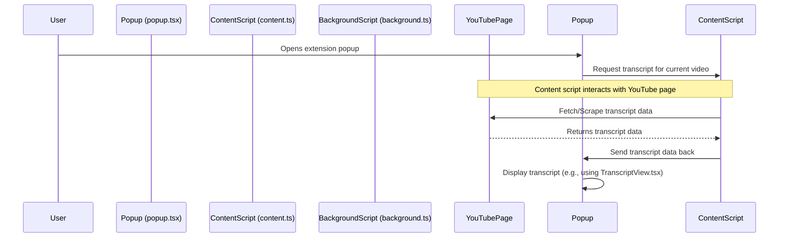

```mermaid
sequenceDiagram
    participant User
    participant Popup (popup.tsx)
    participant ContentScript (content.ts)
    participant BackgroundScript (background.ts)
    participant YouTubePage

    User->>Popup: Opens extension popup
    Popup->>ContentScript: Request transcript for current video
    Note over ContentScript,YouTubePage: Content script interacts with YouTube page
    ContentScript->>YouTubePage: Fetch/Scrape transcript data
    YouTubePage-->>ContentScript: Returns transcript data
    ContentScript->>Popup: Send transcript data back
    Popup->>Popup: Display transcript (e.g., using TranscriptView.tsx)
```
